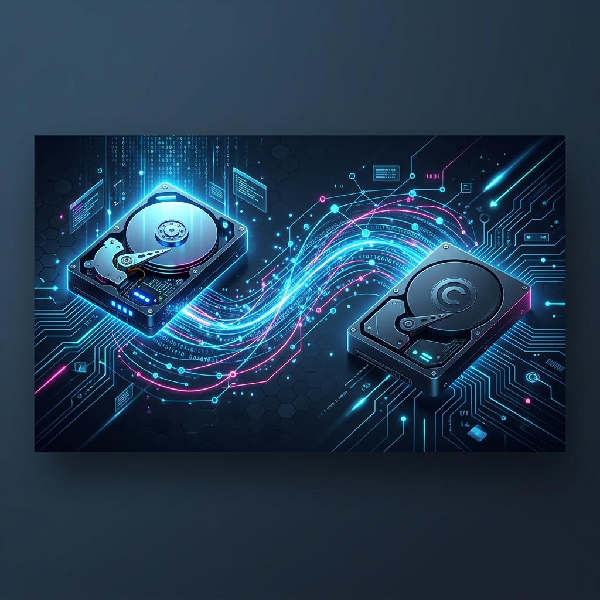

# Clonar Mídia

<p align="center">
  
</p>

[](https://github.com/erascardsilva/clonarMidia/actions)
[](https://snapcraft.io/clonarmidia)
[](https://opensource.org/licenses/MIT)


**Clonar Mídia** is a professional, high-performance disk and partition cloning tool designed for Linux. Built with modern technologies, it provides a sleek interface for complex low-level hardware operations.

---

## 🛠 Built With


---

## 📦 Distribution Models (Important)

This project follows a **Hybrid Distribution Model** to balance ease of access with unrestricted hardware performance.

### 1. Demo Version (Snap Store)
The version available on the **Snap Store** runs in a restricted "Strict" sandbox. 
- **Security**: Fully isolated from your system.
- **Limitation**: Due to Snap's security policies, it **cannot** directly access raw block devices (disks) for cloning.
- **Purpose**: Ideal for exploring the UI, receiving automated update notifications, and checking project metrics.

### 2. Full Version (.deb / .rpm)
The **Native Installers** provide unrestricted hardware access.
- **Performance**: Full raw disk access enabled.
- **Capabilities**: All cloning and recovery features (TestDisk, PhotoRec, fsck) work at full capacity.
- **Recommendation**: Always keep the Snap version installed for update alerts, but use the `.deb` or `.rpm` for real data operations.

---

## 🚀 Installation

### Option A: Install Demo (Snap)

[](https://snapcraft.io/clonarmidia)

```bash
sudo snap install clonarmidia --edge
```


### Option B: Install Full Version (Recommended for Cloning)
Download the latest installers directly from our build folder:
- [**Download .deb (Ubuntu/Debian)**](https://github.com/erascardsilva/clonarMidia/raw/main/build/bin/clonarmidia_1.0.0_amd64.deb)
- [**Download .rpm (Fedora/RedHat)**](https://github.com/erascardsilva/clonarMidia/raw/main/build/bin/clonarmidia-1.0.0-1.fc44.x86_64.rpm)

---

## 🏗 Build from Source

### Prerequisites
- **Go 1.21+**
- **Node.js 18+**
- **Wails CLI** (`go install github.com/wailsapp/wails/v2/cmd/wails@latest`)
- **System Libs**: `libgtk-3-dev`, `libwebkit2gtk-4.1-dev`

### Compilation
```bash
wails build -m -tags webkit2_41 -o clonarmidia
```

---

## ❤️ Support the Project

If this tool helped you recover data or save time, consider supporting the developer:

[](https://www.paypal.com/ncp/payment/8V6WQCGN6HDCQ)

---


**Erasmo Cardoso**<br>
*Software Engineer | Electronics Technician*
